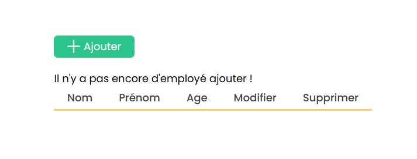
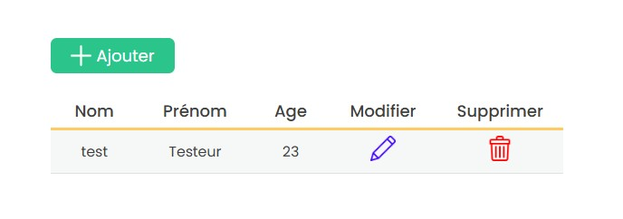
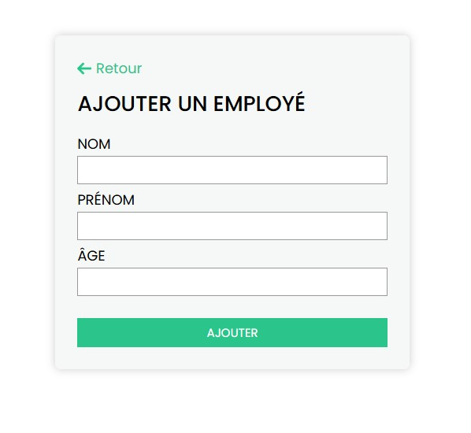

# Projet CRUD PHP

     
     
     

## Exécution du projet

. **Lancer le projet** :
   - Placez le dossier du projet dans le répertoire `www` de votre serveur local (par exemple, Laragon ou XAMPP).
   - Démarrez votre serveur local.
   - Accédez au projet via votre navigateur à l'adresse : `http://localhost/CRUD%20PHP`.

## Auteur

Ce projet a été réalisé dans le cadre d'un apprentissage des fonctionnalités CRUD en PHP.
